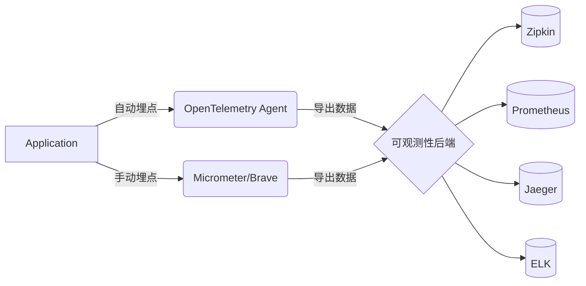
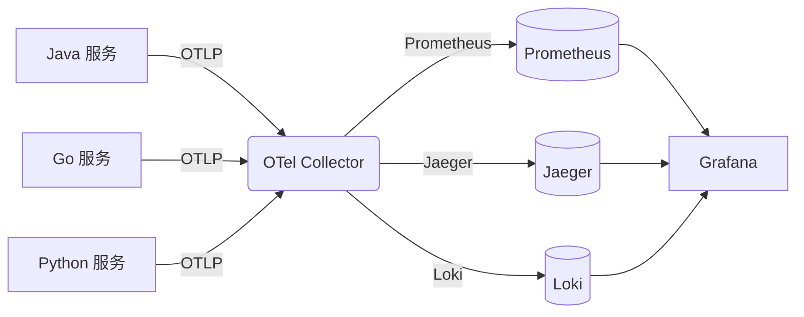
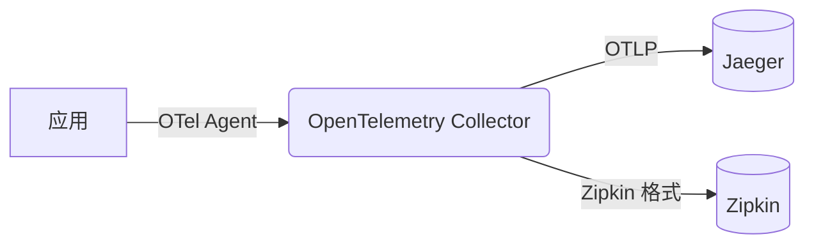
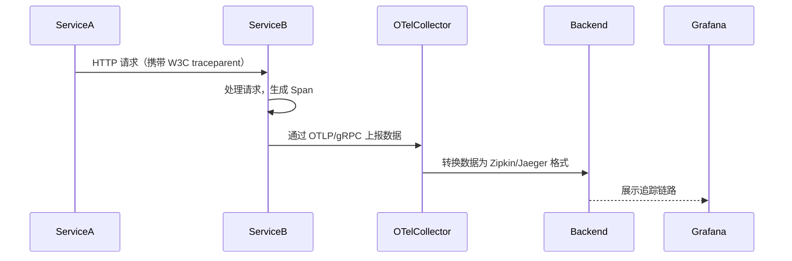

---

### **OpenTelemetry (OTel) 核心总结与关键概念**

---

#### **1. 核心价值**
✅ **全栈可观测性**：统一 Metrics（指标）、Traces（链路追踪）、Logs（日志）的标准化采集，解决数据孤岛问题。  
✅ **跨语言支持**：Java、Go、Python、JS 等主流语言均提供 SDK 和 Agent，实现异构系统统一监控。  
✅ **无侵入式埋点**：通过字节码增强（Java Agent）自动采集常见框架（HTTP、DB、消息队列）数据，降低接入成本。  
✅ **开放协议（OTLP）**：数据通过 OTLP 协议传输，兼容 Prometheus、Jaeger、Grafana 等生态工具，避免厂商锁定。

---

#### **2. 关键组件**
🔧 **OTel SDK/API**：提供手动埋点接口（如 `Tracer`、`Meter`），支持自定义业务逻辑监控。  
🛠️ **OTel Agent**：自动注入埋点逻辑，零代码改造实现基础监控（如 HTTP 请求耗时、DB 调用次数）。  
🚀 **OTel Collector**：核心数据管道，负责接收、处理、转发数据到后端（如过滤、采样、格式转换）。

---

#### **3. 协议与上下文传播**
🌐 **W3C Trace Context**：默认的上下文传播标准（HTTP 头 `traceparent`），确保跨服务链路连续性。  
🔄 **B3 Propagation**：Zipkin 的旧协议（`X-B3-*` 头），用于兼容历史系统。  
📡 **OTLP**：OTel 专用传输协议（基于 gRPC/HTTP），高效上报数据到 Collector 或后端。

---

#### **4. 与现有工具的协作**
🔌 **存储与可视化**：
- **Metrics** → Prometheus、InfluxDB
- **Traces** → Jaeger、Zipkin、Tempo
- **Logs** → Loki、ELK  
  🖥️ **展示工具**：Grafana（统一看板）、Kibana（日志分析）、Jaeger UI（链路追踪）。

---

#### **5. 关键进阶概念**
🎯 **采样策略（Sampling）**：
- **头部采样**（Head-based）：在请求开始时决定是否记录（如 `parentbased_traceidratio`）。
- **尾部采样**（Tail-based）：根据完整链路结果决策（需 Collector 支持），节省存储成本。

🔗 **上下文传播（Context Propagation）**：
- 自动传递 `TraceID` 到异步线程、消息队列、RPC 调用，确保跨服务/跨线程链路完整。

⚡ **性能与安全**：
- **低开销**：Agent 默认 CPU 开销 <3%，支持异步批量上报。
- **数据过滤**：通过 Collector 移除敏感信息（如脱敏手机号、密码）。

---

#### **6. 实际应用场景**
🌩️ **云原生监控**：Kubernetes + OTel + Prometheus/Grafana，实现自动扩缩容和故障定位。  
🔧 **遗留系统改造**：通过 Agent 无侵入接入，快速生成基础监控数据。  
📊 **业务可观测性**：手动埋点统计订单成功率、支付耗时等核心业务指标。

---

#### **7. 常见遗漏概念**
🛡️ **安全合规**：
- **数据脱敏**：通过 Collector Processor 过滤敏感字段。
- **访问控制**：OTel Collector 支持 TLS 加密和 OAuth 2.0 认证。

📦 **组件架构**：
- **OTel SDK**：集成到应用中，负责生成数据。
- **OTel Agent**：独立进程，负责自动埋点和数据转发。
- **OTel Collector**：中心化数据管道，支持扩展插件（如自定义数据处理逻辑）。

---

#### **8. 下一步学习建议**
📚 **动手实践**：
1. 使用 Docker 部署 OTel Collector + Jaeger + Prometheus + Grafana。
2. 为 Spring Boot 应用接入 OTel Agent，生成自动埋点数据。
3. 编写手动埋点代码，统计自定义业务指标。

🔗 **扩展阅读**：
- [OTel 官方文档](https://opentelemetry.io/docs/)
- [Grafana 全栈监控实战](https://grafana.com/tutorials/)
- [CNCF 可观测性白皮书](https://www.cncf.io/reports/cloud-native-observability/)

---
AI Study: https://yuanbao.tencent.com/bot/app/share/chat/1mUgBvkz9Lbf

